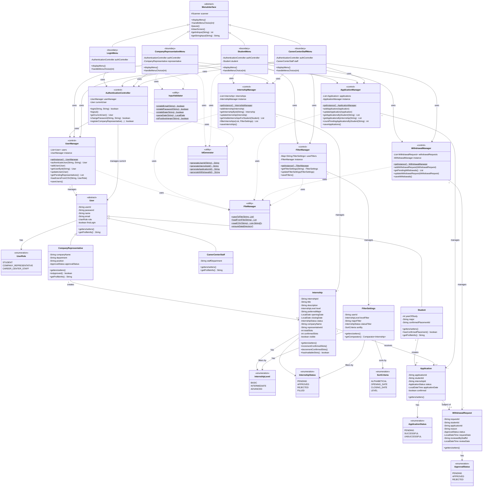

# UML Class Diagram

## OO Principles Applied

1. **Inheritance**: User hierarchy (Student, CompanyRepresentative, CareerCenterStaff extend User)
2. **Polymorphism**: Overridden getProfileInfo() for role-specific information, Menu implementations
3. **Encapsulation**: Private fields with public getters/setters, business logic encapsulated in methods
4. **Abstraction**: Abstract User and MenuInterface classes define contracts
5. **Composition**: Managers composed into boundary classes rather than inherited
6. **Singleton Pattern**: All Manager classes ensure single instance (getInstance())
7. **Separation of Concerns**: Entity-Control-Boundary architecture with clear layer responsibilities

## Key Relationships

- **1:N Associations**: One manager manages many entities (UserManager manages Users, etc.)
- **Inheritance**: Hierarchical class structures for User and MenuInterface
- **Dependencies**: Boundary classes depend on control layer, control layer depends on entity layer
- **Multiplicity**: Student creates 0..* Applications, CompanyRep creates 0..5 Internships
- **Aggregation**: FilterSettings and enumerations represent value objects used by entities
