## UML Class Diagram

- Encapsulation: User fields are private/protected; accessed via getters/setters.

- Inheritance / Polymorphism: User → Student/CompanyRepresentative/CareerCenterStaff; MenuInterface → StudentMenu/CompanyRepresentativeMenu.

- Abstraction: MenuInterface and User define abstract methods like displayMenu() and getProfileInfo().

- Aggregation: UserManager aggregates User objects; ApplicationManager aggregates Application objects; InternshipManager aggregates Internship objects.

- Single Responsibility Principle: Each manager handles a specific domain: ApplicationManager → applications, WithdrawalManager → withdrawals, FilterManager → filters.

- Liskov Substitution Principle: User references can hold any subclass like Student or CompanyRepresentative.

- Open-Closed Principle:
    1. MenuInterface and User Menus

        MenuInterface (abstract class)

        Defines displayMenu() and handleMenuChoice() as abstract methods.

        StudentMenu, CompanyRepresentativeMenu, CareerCenterStaffMenu

        Each inherits from MenuInterface and implements its own behavior.

        OCP applied: You can add a new type of menu for another user role without changing MenuInterface or existing menus.

    2. User hierarchy

        User (abstract class)

        Extended by Student, CompanyRepresentative, CareerCenterStaff.

        Each subclass overrides getProfileInfo().

        OCP applied: You can add a new user type (e.g., Alumni) without modifying User class.