# UML Sequence Diagram: Company Representative Internship Management and Application Review

This diagram shows the complete flow for a company representative creating an internship opportunity, toggling its visibility, and reviewing student applications.

```mermaid
sequenceDiagram
    actor CR as CompanyRepresentative
    participant LoginMenu
    participant AuthCtrl as AuthenticationController
    participant UserMgr as UserManager
    participant CRMenu as CompanyRepresentativeMenu
    participant IntMgr as InternshipManager
    participant FilterMgr as FilterManager
    participant Validator as InputValidator
    participant IdGen as IdGenerator
    participant Internship
    participant FileMgr as FileManager
    participant StaffMenu as CareerCenterStaffMenu
    participant AppMgr as ApplicationManager
    participant Application
    participant Student
    participant StudentMenu

    %% Login Flow
    rect rgb(240, 248, 255)
        Note over CR,UserMgr: 1. Authentication Flow
        CR->>LoginMenu: getStringInput("User ID: ")
        LoginMenu-->>CR: userId
        CR->>LoginMenu: getStringInput("Password: ")
        LoginMenu-->>CR: password
        CR->>+LoginMenu: handleLogin()
        LoginMenu->>+AuthCtrl: login(userId, password)
        AuthCtrl->>+UserMgr: authenticateUser(userId, password)
        Note over UserMgr: Single stream filter:<br/>userId + password match
        UserMgr-->>-AuthCtrl: User (or null)
        
        alt user == null
            AuthCtrl-->>LoginMenu: false (login failed)
        else user instanceof CompanyRepresentative
            AuthCtrl->>AuthCtrl: check rep.isApproved()
            alt not approved
                AuthCtrl-->>LoginMenu: false (not approved)
            else approved
                AuthCtrl->>AuthCtrl: setCurrentUser(user)
                AuthCtrl-->>LoginMenu: true (success)
            end
        else other user types
            AuthCtrl->>AuthCtrl: setCurrentUser(user)
            AuthCtrl-->>LoginMenu: true (success)
        end
        
        AuthCtrl-->>-LoginMenu: return
        LoginMenu-->>-CR: Display result
    end

    %% Menu Display
    rect rgb(255, 250, 240)
        Note over CR,CRMenu: 2. Menu Navigation
        CR->>+CRMenu: Navigate to menu
        CRMenu->>CRMenu: displayMenu()
        CRMenu-->>-CR: Show menu options
    end

    %% Create Internship
    rect rgb(240, 255, 240)
        Note over CR,FileMgr: 3. Create Internship Opportunity
        CR->>+CRMenu: Select "Create Internship"
        CRMenu->>+IntMgr: countInternshipsByRepresentative(repId)
        IntMgr->>IntMgr: filter by representativeId
        IntMgr-->>-CRMenu: count (must be < 5)

        alt count >= 5
            CRMenu-->>CR: Error: Maximum limit reached
        else count < 5
            CRMenu-->>CR: Prompt for details
            CR->>CRMenu: Enter internship details

            CRMenu->>+Validator: isValidDate(openingDate)
            Validator-->>-CRMenu: validation result
            CRMenu->>+Validator: isValidDate(closingDate)
            Validator-->>-CRMenu: validation result

            CRMenu->>+IdGen: generateInternshipId()
            IdGen-->>-CRMenu: new internship ID

            CRMenu->>+IntMgr: addInternship(id, title, desc, level, major, dates, company, repId, slots)
            IntMgr->>+Internship: new Internship(...)
            Internship->>Internship: set status = PENDING
            Internship->>Internship: set visible = true
            Internship-->>-IntMgr: Internship object
            IntMgr->>IntMgr: add to list
            IntMgr->>+FileMgr: saveToFile(internships)
            FileMgr->>FileMgr: serialize to file
            FileMgr-->>-IntMgr: saved
            IntMgr-->>-CRMenu: success
            CRMenu-->>-CR: Internship created (PENDING)
        end
    end

    %% Staff Approval (Alternative Flow)
    rect rgb(255, 245, 238)
        Note over StaffMenu,FileMgr: 4. Staff Approval (Alternative Flow)
        StaffMenu->>+IntMgr: getPendingInternships()
        IntMgr-->>-StaffMenu: list of pending internships

        StaffMenu->>StaffMenu: Staff selects internship
        StaffMenu->>+IntMgr: reviewInternship(internship, decision=1)
        IntMgr->>+Internship: setStatus(APPROVED)
        Internship-->>-IntMgr: status updated
        IntMgr->>+FileMgr: saveToFile(internships)
        FileMgr-->>-IntMgr: saved
        IntMgr-->>-StaffMenu: success

        Note over Internship: Internship now APPROVED<br/>and visible to students
    end

    %% View Internships
    rect rgb(245, 245, 255)
        Note over CR,IntMgr: 5. View My Internships
        CR->>+CRMenu: Select "View My Internships"
        CRMenu->>+IntMgr: getInternshipsByRepresentative(repId)
        IntMgr->>IntMgr: filter by representativeId
        IntMgr-->>-CRMenu: List<Internship>
        CRMenu-->>-CR: Display list with details
    end

    %% Toggle Visibility
    rect rgb(255, 240, 245)
        Note over CR,FileMgr: 6. Toggle Visibility
        CR->>+CRMenu: Select "Toggle Visibility"
        CRMenu->>+FilterMgr: getFilterSettings(repId)
        FilterMgr-->>-CRMenu: FilterSettings
        CRMenu->>+IntMgr: getInternshipsByRepresentative(repId)
        IntMgr->>IntMgr: filter by representativeId
        IntMgr-->>-CRMenu: List<Internship>
        CRMenu->>+IntMgr: filterInternships(internships, settings)
        IntMgr-->>-CRMenu: filtered internships
        CRMenu-->>CR: Show internships

        CR->>CRMenu: Select internship to toggle
        CRMenu->>+IntMgr: toggleInternshipVisibility(internship)
        IntMgr->>+Internship: setVisible(!currentVisibility)
        Internship-->>-IntMgr: visibility updated
        IntMgr->>+FileMgr: saveToFile(internships)
        FileMgr-->>-IntMgr: saved
        IntMgr-->>-CRMenu: success
        CRMenu-->>-CR: Visibility toggled
    end

    %% Edit Internship Details
    rect rgb(255, 250, 245)
        Note over CR,FileMgr: 6a. Edit Internship Details
        CR->>+CRMenu: Select "Edit Internship"
        CRMenu->>+FilterMgr: getFilterSettings(repId)
        FilterMgr-->>-CRMenu: FilterSettings
        CRMenu->>+IntMgr: getInternshipsByRepresentative(repId)
        IntMgr->>IntMgr: filter by representativeId
        IntMgr-->>-CRMenu: List<Internship>
        CRMenu->>+IntMgr: filterInternships(internships, settings)
        IntMgr-->>-CRMenu: filtered internships
        CRMenu-->>CR: Show filtered internship list

        CR->>CRMenu: Select internship to edit
        CRMenu->>Internship: getStatus()
        Internship-->>CRMenu: status

        alt status == APPROVED || status == FILLED
            CRMenu-->>CR: Error: Cannot edit approved or filled internships
        else status != APPROVED && status != FILLED
            CRMenu-->>CR: Show field options (Title, Description, Preferred Major)
            CR->>CRMenu: Select field & enter new value
            CRMenu->>CRMenu: validate input (non-empty)

            alt invalid input
                CRMenu-->>CR: Error: Invalid input
            else valid input
                CRMenu->>+IntMgr: editInternshipField(internship, fieldChoice, newValue)
                
                alt fieldChoice == 1 (Title)
                    IntMgr->>+Internship: setTitle(newValue)
                    Internship-->>-IntMgr: title updated
                else fieldChoice == 2 (Description)
                    IntMgr->>+Internship: setDescription(newValue)
                    Internship-->>-IntMgr: description updated
                else fieldChoice == 3 (Preferred Major)
                    IntMgr->>+Internship: setPreferredMajor(newValue)
                    Internship-->>-IntMgr: preferredMajor updated
                end

                IntMgr->>+Internship: setStatus(PENDING)
                Internship-->>-IntMgr: status reset to PENDING
                IntMgr->>IntMgr: updateInternship(internship)
                IntMgr->>IntMgr: update in list
                IntMgr->>+FileMgr: saveToFile(internships)
                FileMgr->>FileMgr: serialize to file
                FileMgr-->>-IntMgr: saved
                IntMgr-->>-CRMenu: success
                CRMenu-->>-CR: Internship updated successfully
            end
        end
    end

    %% Student Applies (External Flow)
    rect rgb(250, 250, 250)
        Note over CR,Application: 7. Student Application (External)
        Note over AppMgr,Application: Student applies via StudentMenu
        
        StudentMenu->>StudentMenu: check student.hasConfirmedPlacement()
        alt has confirmed placement
            StudentMenu-->>StudentMenu: reject (already placed)
        else no confirmed placement
            StudentMenu->>+AppMgr: countPendingApplicationsByStudent(studentId)
            AppMgr-->>-StudentMenu: count
            
            alt count >= 3
                StudentMenu-->>StudentMenu: reject (max pending reached)
            else count < 3
                StudentMenu->>+IdGen: generateApplicationId()
                IdGen-->>-StudentMenu: application ID
                
                StudentMenu->>+AppMgr: addApplication(appId, studentId, internshipId)
                AppMgr->>+IntMgr: getInternshipById(internshipId)
                IntMgr-->>-AppMgr: Internship
                AppMgr->>AppMgr: check closing date vs today
                
                alt after closing date
                    AppMgr-->>StudentMenu: false (past deadline)
                else before/on closing date
                    AppMgr->>+Application: new Application(appId, studentId, internshipId)
                    Application->>Application: set status = PENDING
                    Application->>Application: set applicationDate = now()
                    Application-->>-AppMgr: Application object
                    AppMgr->>AppMgr: add to list
                    AppMgr->>+FileMgr: saveToFile(applications)
                    FileMgr-->>-AppMgr: saved
                    AppMgr-->>StudentMenu: true (success)
                end
                AppMgr-->>-StudentMenu: return
            end
        end
    end

    %% View Applications
    rect rgb(240, 255, 255)
        Note over CR,UserMgr: 8. View Applications
        CR->>+CRMenu: Select "View Applications"
        CRMenu->>+FilterMgr: getFilterSettings(repId)
        FilterMgr-->>-CRMenu: FilterSettings
        CRMenu->>+IntMgr: getInternshipsByRepresentative(repId)
        IntMgr->>IntMgr: filter by representativeId
        IntMgr-->>-CRMenu: List<Internship>
        CRMenu->>+IntMgr: filterInternships(internships, settings)
        IntMgr-->>-CRMenu: filtered internships
        CRMenu-->>CR: Show internships

        CR->>CRMenu: Select internship
        CRMenu->>+AppMgr: getApplicationsByInternship(internshipId)
        AppMgr->>AppMgr: filter by internshipId
        AppMgr-->>-CRMenu: List<Application>

        loop for each application
            CRMenu->>+UserMgr: getUserById(studentId)
            UserMgr-->>-CRMenu: Student
        end

        CRMenu-->>-CR: Display applications with student details
    end

    %% Review Application
    rect rgb(255, 248, 240)
        Note over CR,FileMgr: 9. Review & Approve Application
        CR->>+CRMenu: Select "Review Application"
        CRMenu->>+FilterMgr: getFilterSettings(repId)
        FilterMgr-->>-CRMenu: FilterSettings
        CRMenu->>+IntMgr: getInternshipsByRepresentative(repId)
        IntMgr->>IntMgr: filter by representativeId
        IntMgr-->>-CRMenu: List<Internship>
        CRMenu->>+IntMgr: filterInternships(internships, settings)
        IntMgr-->>-CRMenu: filtered internships
        CRMenu-->>CR: Show internships
        
        CR->>CRMenu: Select internship
        CRMenu->>+AppMgr: getApplicationsByInternshipandStatus(internshipId, PENDING)
        AppMgr->>AppMgr: filter by internshipId and status
        AppMgr-->>-CRMenu: pending applications
        
        loop for each application
            CRMenu->>+UserMgr: getUserById(studentId)
            UserMgr-->>-CRMenu: Student
        end
        
        CRMenu-->>CR: Show pending applications with student details

        CR->>CRMenu: Select & approve application (decision=1)
        CRMenu->>+AppMgr: reviewApplication(application, decision)
        
        alt decision = 1 (approve)
            AppMgr->>+IntMgr: getInternshipById(internshipId)
            IntMgr-->>-AppMgr: Internship
            AppMgr->>AppMgr: calculate available slots
            Note over AppMgr: availableSlots = totalSlots<br/>- confirmedSlots<br/>- successfulCount
            
            alt availableSlots > 0
                AppMgr->>+Application: setStatus(SUCCESSFUL)
                Application-->>-AppMgr: status updated
                AppMgr->>AppMgr: update in list
                AppMgr->>+FileMgr: saveToFile(applications)
                FileMgr-->>-AppMgr: saved
            else no slots available
                Note over AppMgr: Application remains PENDING
            end
        else decision = 2 (reject)
            AppMgr->>+Application: setStatus(UNSUCCESSFUL)
            Application-->>-AppMgr: status updated
            AppMgr->>AppMgr: update in list
            AppMgr->>+FileMgr: saveToFile(applications)
            FileMgr-->>-AppMgr: saved
        end
        
        AppMgr-->>-CRMenu: success
        CRMenu-->>-CR: Application reviewed
    end

    %% Student Accepts (External Flow)
    rect rgb(250, 250, 250)
        Note over StudentMenu,FileMgr: 10. Student Accepts Placement (External)
        Note over StudentMenu: Student accepts via StudentMenu
        
        StudentMenu->>+AppMgr: handleApplicationAcceptance(student, application)
        
        AppMgr->>+Application: setStatus(CONFIRMED)
        Application-->>-AppMgr: status updated
        AppMgr->>+FileMgr: saveToFile(applications)
        FileMgr-->>-AppMgr: saved
        
        AppMgr->>+Student: setConfirmedPlacementId(internshipId)
        Student-->>-AppMgr: placement set
        AppMgr->>+UserMgr: updateUser(student)
        UserMgr->>+FileMgr: saveToFile(users)
        FileMgr-->>-UserMgr: saved
        UserMgr-->>-AppMgr: student updated
        
        AppMgr->>+IntMgr: getInternshipById(internshipId)
        IntMgr-->>-AppMgr: Internship
        
        AppMgr->>+Internship: incrementConfirmedSlots()
        Internship->>Internship: confirmedSlots++
        alt confirmedSlots >= totalSlots
            Internship->>Internship: setStatus(FILLED)
        end
        Internship-->>-AppMgr: slots updated
        
        AppMgr->>+IntMgr: updateInternship(internship)
        IntMgr->>+FileMgr: saveToFile(internships)
        FileMgr-->>-IntMgr: saved
        IntMgr-->>-AppMgr: internship updated
        
        AppMgr->>AppMgr: getApplicationsByStudent(studentId)
        AppMgr->>AppMgr: filter other SUCCESSFUL applications
        
        loop for each other successful application
            AppMgr->>+Application: setStatus(UNSUCCESSFUL)
            Application-->>-AppMgr: status updated
            AppMgr->>+FileMgr: saveToFile(applications)
            FileMgr-->>-AppMgr: saved
        end
        
        AppMgr-->>-StudentMenu: acceptance complete
        
        Note over AppMgr: All other successful applications<br/>automatically rejected
    end

    %% Logout
    rect rgb(245, 245, 245)
        Note over CR,AuthCtrl: 11. Logout
        CR->>+CRMenu: Select "Logout"
        CRMenu->>+AuthCtrl: logout()
        AuthCtrl->>AuthCtrl: setCurrentUser(null)
        AuthCtrl-->>-CRMenu: logged out
        CRMenu-->>-CR: Return to login screen
    end
```

## Key Interaction Points

1. **Authentication Flow**:
   - User provides credentials via LoginMenu.getStringInput() method calls
   - LoginMenu calls AuthenticationController.login()
   - AuthenticationController calls UserManager.authenticateUser() which performs a single stream filter for userId + password match
   - AuthenticationController checks approval status for company representatives (not UserManager)
   - Returns boolean to LoginMenu indicating success/failure

2. **Internship Creation**:
   - Checks 5 internship limit per representative via InternshipManager
   - Validates dates using InputValidator
   - Generates unique ID via IdGenerator
   - **InternshipManager creates the Internship entity** (not the menu)
   - Sets initial status to PENDING and visibility to true
   - InternshipManager persists via FileManager serialization

3. **Staff Approval Flow**:
   - Alternative flow executed by Career Center Staff
   - Staff calls InternshipManager.reviewInternship() with decision
   - Manager sets status from PENDING to APPROVED/REJECTED
   - Required before students can see internship (APPROVED + visible)

4. **Visibility Toggle**:
   - Menu retrieves filter settings from FilterManager for initial listing
   - Gets internships via InternshipManager and applies filters
   - Menu calls InternshipManager.toggleInternshipVisibility()
   - Manager invokes Internship.setVisible() and updates persistence
   - Immediate effect on student views
   - Company representative retains access regardless

5. **Edit Internship Details**:
   - Menu retrieves filter settings from FilterManager for initial listing
   - Gets internships via InternshipManager and applies filters
   - Editing restricted to non-APPROVED and non-FILLED internships
   - Only allows editing Title, Description, and Preferred Major fields
   - Menu calls InternshipManager.editInternshipField() with field choice and new value
   - Manager invokes appropriate Internship setter (setTitle/setDescription/setPreferredMajor)
   - Manager automatically resets status to PENDING after edit
   - Manager updates internship via updateInternship() and persists via FileManager
   - Ensures edited internships require re-approval from staff

5a. **Student Application** (Boundary-Layer Guards):
   - StudentMenu checks student.hasConfirmedPlacement() before allowing application
   - StudentMenu checks pending application count (max 3) via ApplicationManager
   - **StudentMenu generates application ID** via IdGenerator (not ApplicationManager)
   - StudentMenu calls ApplicationManager.addApplication() with pre-generated ID
   - ApplicationManager validates closing date before creating Application entity
   - Returns boolean to StudentMenu indicating success/failure

6. **Application Review**:
   - Menu retrieves filter settings from FilterManager for initial listing
   - Gets internships via InternshipManager and applies filters
   - Representative selects internship and views pending applications
   - Menu calls ApplicationManager.getApplicationsByInternshipandStatus()
   - Queries UserManager for student details in display loop
   - **Menu calls ApplicationManager.reviewApplication()** (not Application.setStatus() directly)
   - Manager checks slot availability before approving (availableSlots = totalSlots - confirmedSlots - successfulCount)
   - Only approves if slots available, otherwise application remains PENDING
   - Manager updates status to SUCCESSFUL/UNSUCCESSFUL and persists

7. **Student Accepts Placement** (Complex Multi-Manager Flow):
   - Student calls ApplicationManager.handleApplicationAcceptance()
   - Sets Application status to CONFIRMED
   - **ApplicationManager directly mutates Student.setConfirmedPlacementId()** before calling UserManager.updateUser()
   - Retrieves Internship via InternshipManager
   - Calls Internship.incrementConfirmedSlots() (auto-sets FILLED if full)
   - Updates Internship via InternshipManager
   - **Automatically rejects all other SUCCESSFUL applications** for that student
   - Multiple persistence operations across all three data files

8. **Slot Management**:
   - Automatic status change to FILLED when confirmedSlots >= totalSlots
   - Handled by Internship.incrementConfirmedSlots() method
   - Prevents overbooking

9. **Data Persistence**:
   - All state changes saved via FileManager
   - Three separate data files: users.dat, internships.dat, applications.dat
   - Serialization preserves object graphs
   - Multiple file operations in complex flows (e.g., acceptance updates all three)

## Design Patterns Demonstrated

- **Singleton**: All Manager classes (UserManager, InternshipManager, ApplicationManager, WithdrawalManager, FilterManager)
- **ECB (Entity-Control-Boundary) Architecture**: 
  - Boundary classes (Menus) never directly modify Entity state
  - All state changes flow through Control classes (Managers)
  - Control classes handle business logic and coordinate Entity updates
  - Control classes manage persistence via FileManager
- **Factory-like**: IdGenerator for unique ID creation with persistent counters
- **Template Method**: MenuInterface provides abstract workflow template for all menu types
- **State Pattern**: Status enumerations (ApplicationStatus, InternshipStatus, ApprovalStatus) with state transition logic

## Architecture Correctness Notes

This diagram accurately reflects the implemented **ECB pattern**:
- **Boundary Layer** (Menus) handles user interaction and display
- **Control Layer** (Managers) contains all business logic and orchestration
- **Entity Layer** (Domain objects) contains only data and simple state methods

Key architectural principle: **Boundary classes NEVER directly modify Entity state**. All modifications go through Manager classes, which ensures:
1. Consistent business rule enforcement
2. Centralized persistence management
3. Transaction-like behavior for complex operations (e.g., student acceptance)
4. Single Responsibility Principle adherence
