# UML Sequence Diagram: Company Representative Internship Management and Application Review

This diagram shows the complete flow for a company representative creating an internship opportunity, toggling its visibility, and reviewing student applications.

```mermaid
sequenceDiagram
    actor CR as CompanyRepresentative
    participant LoginMenu
    participant AuthCtrl as AuthenticationController
    participant UserMgr as UserManager
    participant CRMenu as CompanyRepresentativeMenu
    participant IntMgr as InternshipManager
    participant Validator as InputValidator
    participant IdGen as IdGenerator
    participant Internship
    participant FileMgr as FileManager
    participant StaffMenu as CareerCenterStaffMenu
    participant AppMgr as ApplicationManager
    participant Application

    %% Login Flow
    rect rgb(240, 248, 255)
        Note over CR,UserMgr: 1. Authentication Flow
        CR->>+LoginMenu: Enter credentials
        LoginMenu->>+AuthCtrl: login(userId, password)
        AuthCtrl->>+UserMgr: authenticateUser(userId, password)
        UserMgr->>UserMgr: getUserById()
        UserMgr->>UserMgr: verify password
        UserMgr->>UserMgr: check approval status
        UserMgr-->>-AuthCtrl: User (CompanyRep)
        AuthCtrl-->>-LoginMenu: Login successful
        LoginMenu-->>-CR: Display success
    end

    %% Menu Display
    rect rgb(255, 250, 240)
        Note over CR,CRMenu: 2. Menu Navigation
        CR->>+CRMenu: Navigate to menu
        CRMenu->>CRMenu: displayMenu()
        CRMenu-->>-CR: Show menu options
    end

    %% Create Internship
    rect rgb(240, 255, 240)
        Note over CR,FileMgr: 3. Create Internship Opportunity
        CR->>+CRMenu: Select "Create Internship"
        CRMenu->>+IntMgr: countInternshipsByRepresentative(repId)
        IntMgr->>IntMgr: filter by representativeId
        IntMgr-->>-CRMenu: count (must be < 5)

        alt count >= 5
            CRMenu-->>CR: Error: Maximum limit reached
        else count < 5
            CRMenu-->>CR: Prompt for details
            CR->>CRMenu: Enter internship details

            CRMenu->>+Validator: isValidDate(openingDate)
            Validator-->>-CRMenu: validation result
            CRMenu->>+Validator: isValidDate(closingDate)
            Validator-->>-CRMenu: validation result

            CRMenu->>+IdGen: generateInternshipId()
            IdGen-->>-CRMenu: new internship ID

            CRMenu->>+Internship: new Internship(...)
            Internship->>Internship: set status = PENDING
            Internship->>Internship: set visible = true
            Internship-->>-CRMenu: Internship object

            CRMenu->>+IntMgr: addInternship(internship)
            IntMgr->>IntMgr: add to list
            IntMgr->>+FileMgr: saveToFile(internships)
            FileMgr->>FileMgr: serialize to file
            FileMgr-->>-IntMgr: saved
            IntMgr-->>-CRMenu: success
            CRMenu-->>-CR: Internship created (PENDING)
        end
    end

    %% Staff Approval (Alternative Flow)
    rect rgb(255, 245, 238)
        Note over StaffMenu,FileMgr: 4. Staff Approval (Alternative Flow)
        StaffMenu->>+IntMgr: getPendingInternships()
        IntMgr-->>-StaffMenu: list of pending internships

        StaffMenu->>StaffMenu: Staff selects & approves
        StaffMenu->>+Internship: setStatus(APPROVED)
        Internship-->>-StaffMenu: status updated

        StaffMenu->>+IntMgr: updateInternship(internship)
        IntMgr->>+FileMgr: saveToFile(internships)
        FileMgr-->>-IntMgr: saved
        IntMgr-->>-StaffMenu: success

        Note over Internship: Internship now APPROVED<br/>and visible to students
    end

    %% View Internships
    rect rgb(245, 245, 255)
        Note over CR,IntMgr: 5. View My Internships
        CR->>+CRMenu: Select "View My Internships"
        CRMenu->>+IntMgr: getInternshipsByRepresentative(repId)
        IntMgr->>IntMgr: filter by representativeId
        IntMgr-->>-CRMenu: List<Internship>
        CRMenu-->>-CR: Display list with details
    end

    %% Toggle Visibility
    rect rgb(255, 240, 245)
        Note over CR,FileMgr: 6. Toggle Visibility
        CR->>+CRMenu: Select "Toggle Visibility"
        CRMenu->>+IntMgr: getInternshipsByRepresentative(repId)
        IntMgr-->>-CRMenu: internship list
        CRMenu-->>CR: Show internships

        CR->>CRMenu: Select internship to toggle
        CRMenu->>+Internship: setVisible(!currentVisibility)
        Internship-->>-CRMenu: visibility updated

        CRMenu->>+IntMgr: updateInternship(internship)
        IntMgr->>+FileMgr: saveToFile(internships)
        FileMgr-->>-IntMgr: saved
        IntMgr-->>-CRMenu: success
        CRMenu-->>-CR: Visibility toggled
    end

    %% Student Applies (External Flow)
    rect rgb(250, 250, 250)
        Note over CR,Application: 7. Student Application (External)
        Note over AppMgr,Application: Student applies via StudentMenu
        AppMgr->>+IdGen: generateApplicationId()
        IdGen-->>-AppMgr: application ID
        AppMgr->>+Application: new Application(...)
        Application->>Application: set status = PENDING
        Application-->>-AppMgr: Application object
        AppMgr->>AppMgr: addApplication(application)
    end

    %% View Applications
    rect rgb(240, 255, 255)
        Note over CR,UserMgr: 8. View Applications
        CR->>+CRMenu: Select "View Applications"
        CRMenu->>+IntMgr: getInternshipsByRepresentative(repId)
        IntMgr-->>-CRMenu: internship list
        CRMenu-->>CR: Show internships

        CR->>CRMenu: Select internship
        CRMenu->>+AppMgr: getApplicationsByInternship(internshipId)
        AppMgr->>AppMgr: filter by internshipId
        AppMgr-->>-CRMenu: List<Application>

        loop for each application
            CRMenu->>+UserMgr: getUserById(studentId)
            UserMgr-->>-CRMenu: Student
        end

        CRMenu-->>-CR: Display applications with student details
    end

    %% Review Application
    rect rgb(255, 248, 240)
        Note over CR,FileMgr: 9. Review & Approve Application
        CR->>+CRMenu: Select "Review Application"
        CRMenu->>+AppMgr: getApplicationsByInternship(internshipId)
        AppMgr->>AppMgr: filter PENDING status
        AppMgr-->>-CRMenu: pending applications
        CRMenu-->>CR: Show pending applications

        CR->>CRMenu: Select & approve application
        CRMenu->>+Application: setStatus(SUCCESSFUL)
        Application-->>-CRMenu: status updated

        CRMenu->>+AppMgr: updateApplication(application)
        AppMgr->>AppMgr: update in list
        AppMgr->>+FileMgr: saveToFile(applications)
        FileMgr->>FileMgr: serialize to file
        FileMgr-->>-AppMgr: saved
        AppMgr-->>-CRMenu: success
        CRMenu-->>-CR: Application approved
    end

    %% Student Accepts (External Flow)
    rect rgb(250, 250, 250)
        Note over Application,Internship: 10. Student Accepts Placement (External)
        Note over Application: Student accepts via StudentMenu
        Application->>Application: setConfirmed(true)

        Internship->>+Internship: incrementConfirmedSlots()
        alt slots full
            Internship->>Internship: setStatus(FILLED)
        end
        Internship-->>-Internship: slots updated
    end

    %% Logout
    rect rgb(245, 245, 245)
        Note over CR,AuthCtrl: 11. Logout
        CR->>+CRMenu: Select "Logout"
        CRMenu->>+AuthCtrl: logout()
        AuthCtrl->>AuthCtrl: setCurrentUser(null)
        AuthCtrl-->>-CRMenu: logged out
        CRMenu-->>-CR: Return to login screen
    end
```

## Key Interaction Points

1. **Authentication Flow**:
   - Login validates credentials through UserManager
   - Checks approval status for company representatives
   - Returns User object to AuthenticationController

2. **Internship Creation**:
   - Checks 5 internship limit per representative
   - Validates dates using InputValidator
   - Generates unique ID via IdGenerator
   - Sets initial status to PENDING
   - Persists via FileManager serialization

3. **Staff Approval Flow**:
   - Alternative flow executed by Career Center Staff
   - Required before students can see internship
   - Changes status from PENDING to APPROVED

4. **Visibility Toggle**:
   - Immediate effect on student views
   - Company representative retains access regardless
   - Persisted immediately to file

5. **Application Review**:
   - Representative views all applications per internship
   - Can see student details by querying UserManager
   - Approve/reject changes application status
   - All changes persisted via FileManager

6. **Slot Management**:
   - Automatic status change to FILLED when capacity reached
   - Handled by Internship entity's incrementConfirmedSlots()
   - Prevents overbooking

7. **Data Persistence**:
   - All state changes saved via FileManager
   - Serialization preserves object graphs
   - Atomic file operations

## Design Patterns Demonstrated

- **Singleton**: All Manager classes (UserManager, InternshipManager, ApplicationManager)
- **ECB Architecture**: Clear separation of Entity-Control-Boundary layers
- **Factory-like**: IdGenerator for unique ID creation
- **Template Method**: MenuInterface provides workflow template
- **State Pattern**: Status enumerations with state transition logic
